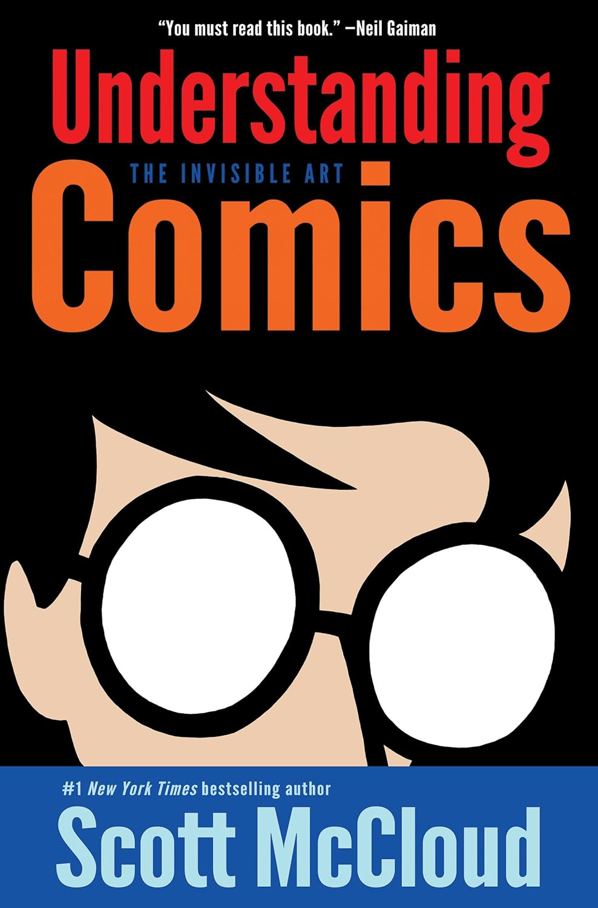
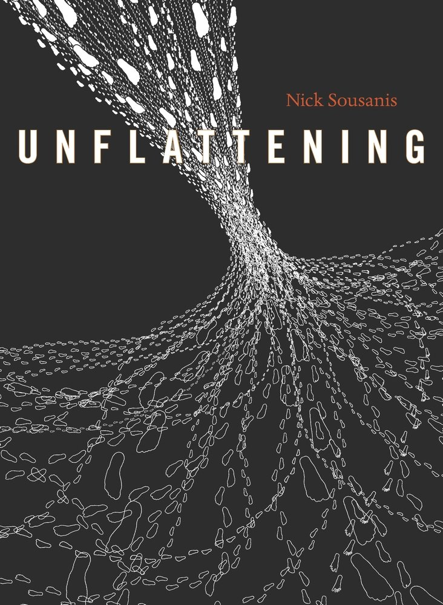

* Comics Catalog
A curation of non-fiction-esque comics

* [[https://amzn.to/4rETPmE][Understanding Comics]]
Understanding Comics is this book which thoroughly changed the way I look at comic books. It is chockful of great ideas, many of which can be / are yet to be applied to interaction design

* [[https://amzn.to/46LhYyg][Unflattening]]

Unflattening is a philosophical contemplation of how our world is increasingly becoming flat and how one can work against this gradual flattening of everything around us. So many cool panels in this one.

